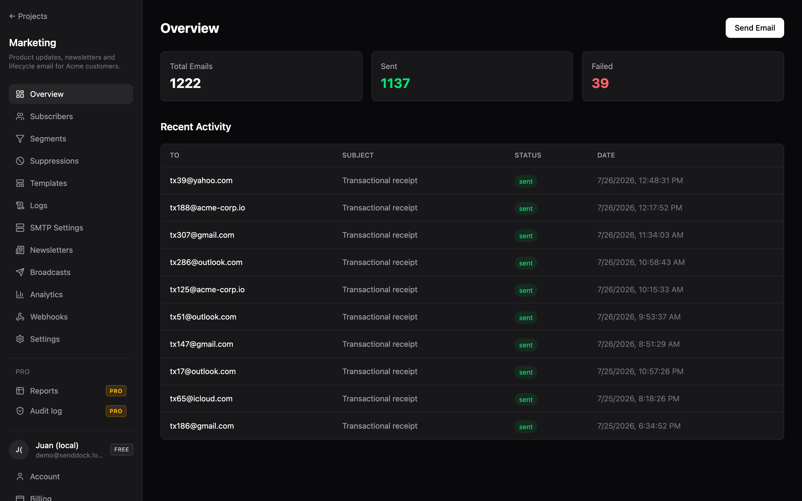
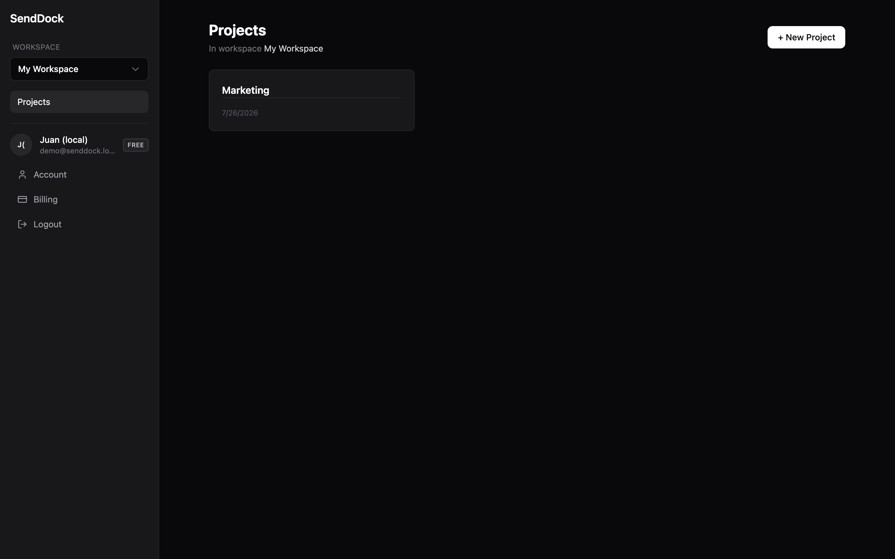
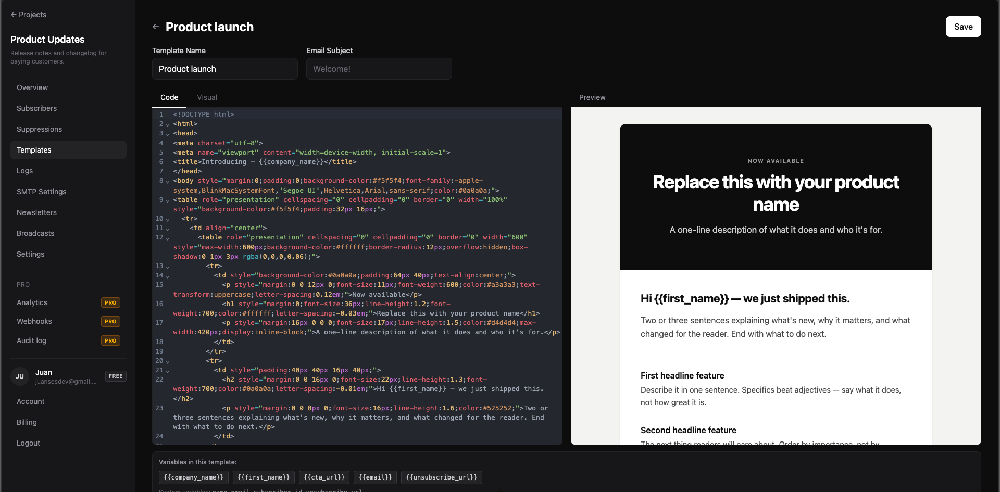
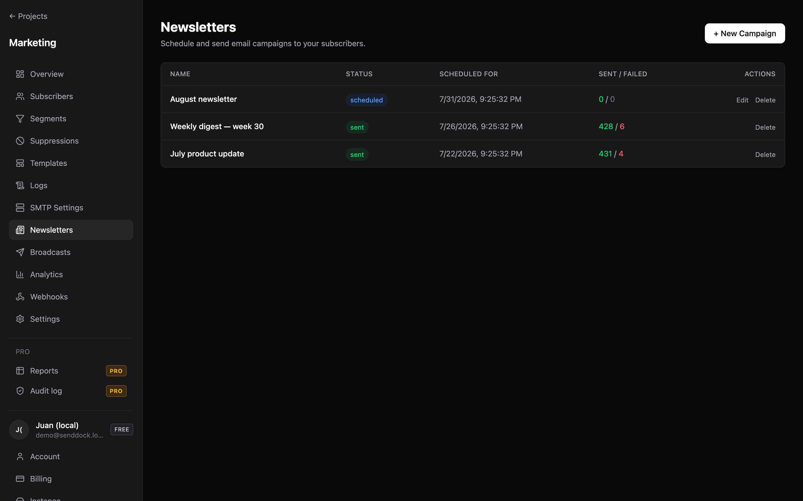
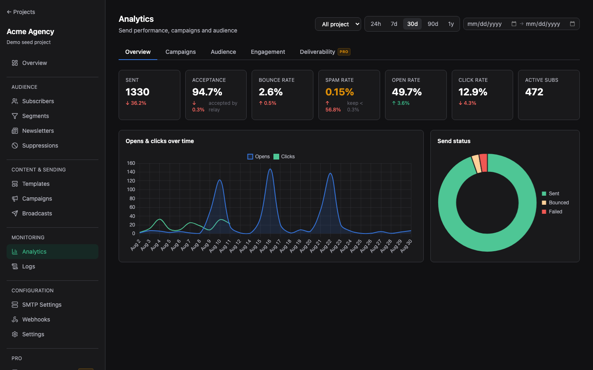

<div align="center">



**Email marketing you actually own.**

Bring your own SMTP, own your subscriber data, send to unlimited contacts. Self-host in 60 seconds with Docker, or use the [managed cloud](https://senddock.dev). Open source under AGPL-3.0 — core-team-only development.

[](LICENSE)
[](https://github.com/arkhe-systems/senddock/releases)
[](https://go.dev)
[](https://vuejs.org)
[](https://github.com/arkhe-systems/senddock/pkgs/container/senddock)
[](https://github.com/arkhe-systems/senddock/stargazers)

[Website](https://senddock.dev) · [Documentation](https://docs.senddock.dev) · [Cloud](https://senddock.dev) · [Roadmap](ROADMAP.md) · [Changelog](CHANGELOG.md)

</div>

---

## Why SendDock

Email marketing tools punish you for growing. Mailchimp charges $135/mo at 10k contacts. ConvertKit/Kit charges $104/mo at the same size. Both lock your subscriber list inside their UI and bill you per email or per contact, forever.

SendDock flips the model: you bring your own SMTP relay (AWS SES, Postmark, Postal, your own Postfix — anything that speaks SMTP), the app handles subscribers, templates, campaigns, tracking and analytics, and you pay $0 to the platform — no matter if you send 1 email or 1 million.

### How it compares

| | Mailchimp | Kit (ConvertKit) | Resend | **SendDock** |
|---|---|---|---|---|
| Monthly cost @ 10k subscribers | ~$135 | ~$104 | ~$35 | **$0** (+ SMTP) |
| Self-hostable | — | — | — | **✓** |
| Open source | — | — | — | **✓ (AGPL-3.0)** |
| Bring your own SMTP | — | — | — | **✓** |
| Per-email pricing | ✓ | — | ✓ | **No** |
| You own subscriber data | — | — | — | **✓** |
| Visual editor | ✓ | ✓ | — | **✓ (GrapesJS)** |
| Transactional API | ✓ | — | ✓ | **✓** |
| Open & click tracking | ✓ | ✓ | ✓ | **✓** |
| One-click unsubscribe (RFC 8058) | ✓ | ✓ | ✓ | **✓** |

> If you already pay AWS SES ($0.10 per 1,000 emails), sending 100k emails costs you **~$10/month total** with SendDock vs **~$135/month** with Mailchimp.

---

## Install in 60 seconds

On **Ubuntu 22.04+ or Arch Linux** with sudo:

```bash
curl -fsSL https://senddock.dev/install.sh | sudo bash
```

The installer takes care of Docker, secrets, the compose file, and starts the stack. When it finishes, open the URL it prints and create your admin account.

> On Debian, Fedora, RHEL, openSUSE, macOS, or any other OS: use the manual Docker Compose path below — it works anywhere Docker runs. Broader installer support is [on the roadmap](https://github.com/Arkhe-Systems/senddock/issues/79).

<details>
<summary>Manual install with Docker Compose (any Linux with Docker)</summary>

```bash
mkdir senddock && cd senddock
curl -fsSL https://raw.githubusercontent.com/arkhe-systems/senddock/main/docker-compose.image.yml -o docker-compose.yml

cat > .env <<EOF
POSTGRES_PASSWORD=$(openssl rand -base64 32)
JWT_SECRET=$(openssl rand -hex 32)
EOF

docker compose up -d
```

Open `https://your-domain.com` and complete the setup screen.

</details>

For Dokploy, reverse-proxy setups, Cloudflare Tunnel, source builds, license activation, and updates, see the [Self-Hosting Guide](https://docs.senddock.dev/self-hosting/installation).

---

## Features

- **Projects** — separate sending domains and subscriber lists for each product, brand, or client.
- **Subscribers** — single add, CSV bulk import (JSON via the API), bulk actions (change status, tags, delete), status segmentation (active / pending / unsubscribed).
- **Templates** — Handlebars-based with dynamic variables, visual editor (GrapesJS) and code editor (CodeMirror).
- **Campaigns** — broadcast to your full list, scheduled sends, send-to-segment, draft and resume.
- **Rich-text send** — a Text/Rich toggle per template variable, so a `{{content}}` block can carry sanitized formatted HTML without hand-writing markup.
- **Analytics (free)** — a tabbed, charted dashboard (Overview, Campaigns, Audience, Engagement) with date ranges, per-campaign breakdowns and a weekday × hour click heatmap.
- **Transactional API** — `POST /send` with template or raw HTML, batch send, API keys per project.
- **Deliverability essentials** — open tracking pixel, click tracking with HMAC-signed redirects, RFC 8058 one-click unsubscribe, suppressions and bounces.
- **Pro tier** — a **Deliverability** dashboard (SPF/DKIM/DMARC health, per-provider accept/bounce/open/spam rates), a dynamic **Report builder** (pivots, segment filters, CSV export), and a per-project **audit log**.
- **SMTP test** — verify your SMTP settings before sending anything.
- **Rate limiting** — per-project (Redis-backed) and per-IP (global) limiters.
- **Security** — JWT auth via HttpOnly cookies, refresh-token rotation, encrypted SMTP credentials, bcrypt password hashing.
- **One-click updates** — bundled Watchtower lets you upgrade from the dashboard.
- **Multi-arch images** — official Docker image runs on `linux/amd64` and `linux/arm64` (Raspberry Pi, AWS Graviton, Apple Silicon VMs).

---

## Screenshots

| | |
|---|---|
|  |  |
| **Workspace dashboard** — organize projects, each its own sending identity. | **Visual editor** — drag-and-drop email composition with GrapesJS. |
|  |  |
| **Campaigns** — broadcast to your list or schedule for later. | **Analytics (free)** — tabbed dashboard: overview, campaigns, audience, engagement. |

---

## Tech stack

- **Backend** — Go 1.25, `net/http` stdlib, [sqlc](https://sqlc.dev) for type-safe queries, [goose](https://github.com/pressly/goose) for migrations.
- **Frontend** — Vue 3 + TypeScript + Vite, Tailwind CSS 4, Pinia state, GrapesJS visual editor, CodeMirror code editor.
- **Storage** — PostgreSQL 17, Redis 7 (rate limits + background queue).
- **Deploy** — single Docker image, multi-arch (amd64 + arm64), Watchtower-ready for self-updates.

---

## Cloud or self-hosted

Both modes use the same BYO-SMTP model — Cloud removes the infrastructure work, not the SMTP setup. Pick based on whether you want to run the app yourself or have us run it for you.

| | Self-hosted (this repo) | [Cloud](https://senddock.dev) |
|---|---|---|
| Setup | One curl command, ~60s | Zero — just sign up |
| Cost | $0 (Core) or $9/mo (Pro license) + your SMTP + your VPS | Free up to 2,000 subs, $19/mo for 10k, scales by tier |
| Bring your own SMTP | Yes | Yes — same model |
| You upgrade the app | `docker compose pull` or one-click in UI | Automatic |
| Backups, monitoring, uptime | Your responsibility | Handled |
| Data location | Your server, your jurisdiction | EU (Frankfurt) |
| Pro features (Deliverability, Reports, Audit log) | Pro license required | Bundled from Starter tier upward |
| Team features (multi-user, roles) | Team license required | Bundled from Growth tier upward |

---

## Who is this for

**SendDock is built for:**

- **Engineers and indie hackers** who already have SMTP figured out (AWS SES, Postmark, Postal, your own Postfix) and want a clean dashboard + API instead of building one themselves.
- **Newsletter publishers and agencies** who refuse to pay $135/mo to Mailchimp for the privilege of managing a subscriber list.
- **Privacy-conscious teams** who need subscriber data to live on their own infrastructure (EU strict residency, healthcare, government, white-label client work).
- **Self-hosting enthusiasts** looking for a modern alternative to Listmonk with real analytics, deliverability insights, and a polished UI.

**SendDock is *not* for:**

- **People who want zero-config deliverability bundled in.** Both self-host and Cloud are BYO-SMTP — you are responsible for sender reputation, dedicated IPs, blocklist monitoring. If you want that handled for you, use Mailchimp, Resend, or Postmark instead.
- **Marketers who need drag-and-drop landing pages, forms, and visual automation workflows today.** These are on the [roadmap](ROADMAP.md) but not yet shipped. Today SendDock excels at transactional email, broadcasts, and templates — not full marketing automation.

---

## Documentation

| | |
|---|---|
| [Getting Started](https://docs.senddock.dev/guide/getting-started) | First-time walkthrough |
| [Self-Hosting Installation](https://docs.senddock.dev/self-hosting/installation) | Docker, Dokploy, reverse proxy, Cloudflare Tunnel |
| [Configuration](https://docs.senddock.dev/self-hosting/configuration) | All environment variables explained |
| [Updating](https://docs.senddock.dev/self-hosting/updating) | One-click and manual updates |
| [Troubleshooting & FAQ](https://docs.senddock.dev/self-hosting/troubleshooting) | SMTP issues, common errors |
| [API Reference](https://docs.senddock.dev/api/authentication) | All endpoints, auth, examples |

---

## Core vs Pro

SendDock is **open-core**. The free Core binary in this repo is a complete, production-ready email platform on its own. A license key unlocks an extra management surface for teams that want it.

**Core** (AGPL-3.0, free, in this repo)
- Projects, subscribers, templates, API keys, campaigns, SMTP management
- Transactional sends, broadcasts, batch sends, scheduled campaigns
- Custom fields, tags, and segments for subscriber targeting
- Open & click tracking, one-click unsubscribe (RFC 8058)
- Webhooks — full management UI and REST API (CRUD, pause/resume, delivery history) with HMAC signing and retries
- Analytics — tabbed dashboard (overview, campaigns, audience, engagement) with charts, date ranges, per-campaign breakdowns and a click heatmap
- Rich-text send — per-variable Text/Rich toggle with server-side sanitization
- Per-project rate limits, encrypted SMTP credentials, JWT auth
- One-click updates via bundled Watchtower

**Pro** (license-gated, included in cloud)
- Deliverability — domain health (SPF/DKIM/DMARC), per-provider accept/bounce/open/spam rates, spam-complaint ingestion
- Report builder — dimensions/measures, 1–2 dimension pivots, segment filters, saved reports, CSV export
- Audit log — who did what, when, from where
- Roadmap: team members & roles, SMTP failover, SSO/LDAP, white-label

A license key (Lemon Squeezy) is available at [senddock.dev/pricing](https://senddock.dev/pricing). An empty `SENDDOCK_LICENSE_KEY` keeps the deployment on Core — fully functional, free forever.

---

## Roadmap

See [ROADMAP.md](ROADMAP.md) for milestones and [GitHub Issues](https://github.com/arkhe-systems/senddock/issues) for what's actively being worked on. Comments, +1s, and well-described feature requests on existing issues help us prioritize.

---

## Running from source

For auditing, forking, or running a modified copy on your own infrastructure.

```bash
# Backend
cd backend && cp .env.example .env && make dev   # http://localhost:8080

# Frontend
cd frontend && npm install && npm run dev        # http://localhost:5173
```

Prerequisites: Go 1.25+, Node 20+, Docker, [goose](https://github.com/pressly/goose), [sqlc](https://sqlc.dev).

| Make target | What it does |
|---|---|
| `make dev` | DB + migrations + server |
| `make run` | Server only |
| `make test` | Unit tests |
| `make sqlc` | Regenerate sqlc code |
| `make migrate` | Apply pending migrations |
| `make build` | Production binary |
| `make db-up` / `make db-down` | Start/stop Postgres + Redis |

---

## Contributing

**Bug reports, feature requests, and security disclosures: very welcome — these are the most useful way to contribute.** Open an issue with reproduction steps, expected vs actual behavior, and your environment.

**Pull requests with code: not accepted on the official repository.** The reason is straightforward — SendDock has a paid Pro tier, and we are not comfortable monetizing volunteer code. The AGPL gives you full freedom to fork, modify, and run your own version with whatever changes you need.

Questions, ideas, or want to show what you've built with SendDock? Open a [GitHub Discussion](https://github.com/arkhe-systems/senddock/discussions) or email **hello@senddock.dev**.

---

## License

AGPL-3.0 — see [LICENSE](LICENSE).

In short: use it internally, fork it, modify it. The AGPL's copyleft clause only triggers if you offer SendDock **as a hosted service to third parties** — in that case, you must release your modifications under the same license.

For a commercial license that exempts you from the AGPL copyleft clause, contact **hello@senddock.dev**.

---

<div align="center">

Part of [Arkhe Systems](https://arkhe.systems)

</div>
