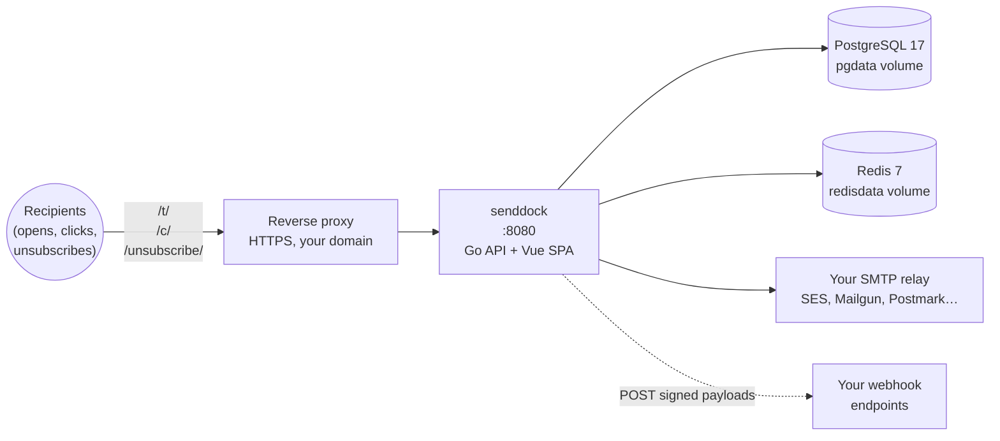

# Installation

SendDock ships as a single Docker image: `ghcr.io/arkhe-systems/senddock`. Three install paths are supported, in order of preference.

## What gets deployed



A single Docker container running the Go binary serves both the API and the Vue SPA. PostgreSQL holds all your data; Redis caches the GitHub releases response and powers per-project rate limits. Your own SMTP relay handles outbound mail — SendDock never proxies your sends.

## Requirements

- A Linux server (Ubuntu, Debian, etc.)
- Docker and Docker Compose
- A **publicly reachable domain** pointed at the server (required for unsubscribe links, broadcasts, and SMTP)
- The server's network must allow **outbound TCP** on the SMTP port your provider uses (usually 465 or 587)

That's it. Everything else is handled by Docker.

::: warning Don't expect to send real emails from a laptop
Most residential ISPs block outbound SMTP ports (25, 465, 587) at the network edge to prevent spam botnets. A SendDock instance on your home network cannot deliver mail through any external SMTP provider — including Gmail, SES, Mailgun, or your own Mailcow if it lives elsewhere. **SendDock in production must run on a cloud server (DigitalOcean, Hetzner, AWS, etc.) where outbound SMTP is unblocked.**

For local development and evaluation, ship `make mail` (or any other [Mailpit](https://mailpit.axllent.org/)-like catcher) and configure SendDock to talk to it on `localhost:1025`. See the [SMTP guide](/guide/smtp) for the workaround details.
:::

---

## Option 1: Prebuilt image (recommended)

The fastest path. Pull the canonical image, point a `.env` at it, run.

```bash
mkdir senddock && cd senddock
curl -fsSL https://raw.githubusercontent.com/arkhe-systems/senddock/main/docker-compose.image.yml -o docker-compose.yml
```

Create `.env` next to it:

```bash
cat > .env <<EOF
POSTGRES_PASSWORD=$(openssl rand -base64 32)
JWT_SECRET=$(openssl rand -hex 32)
PUBLIC_URL=https://your-domain.com
SENDDOCK_PORT=8080
SENDDOCK_LICENSE_KEY=
EOF
```

Replace `your-domain.com` with your real public hostname before running. `PUBLIC_URL` is required for unsubscribe and broadcast links to work.

Then:

```bash
docker compose up -d
```

The container runs `goose up` against Postgres on first start, then serves on `:8080`. Healthcheck tells you when it's ready (~10 seconds cold).

Open `http://your-domain.com` (or `http://localhost:8080` for a local test) and create your admin account on the setup screen.

### What you get

| `SENDDOCK_LICENSE_KEY` | Behavior |
|---|---|
| empty (self-hosted) | All features unlocked locally — useful for evaluating Pro before buying. |
| empty (cloud mode) | Free tier — Core features only (subscribers, templates, transactional sends, broadcasts, campaigns, BYO SMTP, click & open tracking). |
| valid | Pro tier — unlocks the [Analytics dashboard](/guide/analytics) and [Webhooks management](/guide/webhooks). |

The image is the same in both cases. The license key, validated against a hosted endpoint, toggles the gated routes. Read more in the [pricing page](https://senddock.com/pricing).

::: warning Self-hosted with empty license unlocks everything
This is intentional — local development should never need a license. If you self-host an instance that other people will use, set a real `SENDDOCK_LICENSE_KEY` (or accept that Pro features are free for those users). The "empty key = unlocked" behavior only fires when `DEPLOYMENT_MODE=self-hosted`, which is the default.
:::

### Pinning a version in production

`:latest` resolves to the most recently tagged release. For production, pin to a specific version so you control when updates land:

```yaml
services:
  senddock:
    image: ghcr.io/arkhe-systems/senddock:0.5.0
```

See available tags on [GHCR](https://github.com/Arkhe-Systems/senddock/pkgs/container/senddock). Only versioned tags (`X.Y.Z`, `X.Y`, `X`) and `:latest` are public — pre-release builds (`:dev`) live in a separate, private package and are not intended for end users.

---

## Option 2: Dokploy (one-click)

If you run [Dokploy](https://dokploy.com) on your server, SendDock is available in the templates marketplace. Open Dokploy → Templates → search for "SendDock" → Install. Dokploy renders the same `docker-compose.image.yml` shown above, prompts you for the env vars, and starts the stack.

This is the recommended path if you already use Dokploy to manage other apps.

---

## Option 3: Build from source

For self-hosters who want to compile Core from source — useful for audits, custom patches, or running an unreleased branch.

### Linux / macOS

```bash
git clone https://github.com/arkhe-systems/senddock.git
cd senddock
chmod +x setup.sh && ./setup.sh
```

### Windows (PowerShell)

```powershell
git clone https://github.com/arkhe-systems/senddock.git
cd senddock
.\setup.ps1
```

The setup script is **idempotent**:

- **Fresh install**: generates secrets, creates `.env`, builds the image from source, starts services.
- **Existing install**: keeps your `.env`, rebuilds with the current code, restarts services. Same script you use to update — `./setup.sh` after `git pull` is the entire upgrade flow.
- **Reset**: pass `--reset` (or `-Reset` on Windows) to wipe containers, volumes and `.env` before starting fresh. **This deletes all data**, so use it only on test instances.

After running, the script waits for SendDock to be healthy and only then reports success. If startup fails it points at `docker compose logs app`.

This path runs `docker-compose.prod.yml`, which builds the image locally instead of pulling the prebuilt one. The result is the **Core only** — Pro features (Analytics dashboard, Webhooks management) live in a private repository and are not part of source builds. To run Pro you need the prebuilt image (Option 1 or 2) and a license key.

### What gets started

- Go backend compiled from source
- Vue frontend built and served by Go
- PostgreSQL 17 database
- Redis for caching
- Database migrations run automatically

---

## What's running

| Service | Description |
|---------|-------------|
| `senddock` | The SendDock binary (Go API + Vue frontend) on port 8080 |
| `postgres` | PostgreSQL 17 database (named volume `pgdata`) |
| `redis` | Redis 7 for caching (named volume `redisdata`) |

Migrations run inside the `senddock` container's entrypoint on every start, against the existing database. Goose deduplicates already-applied migrations, so restarts and updates never replay them.

---

## Custom port or domain

The `.env` you created controls both:

```bash
PUBLIC_URL=https://your-domain.com
SENDDOCK_PORT=8080
```

`PUBLIC_URL` is required for unsubscribe links and broadcasts to work — without it the broadcast endpoint refuses to send.

---

## Reverse proxy (HTTPS)

For production, put SendDock behind a reverse proxy with HTTPS.

### Caddy

```
your-domain.com {
    reverse_proxy localhost:8080
}
```

### Nginx

```nginx
server {
    listen 443 ssl;
    server_name your-domain.com;

    ssl_certificate /path/to/cert.pem;
    ssl_certificate_key /path/to/key.pem;

    location / {
        proxy_pass http://localhost:8080;
        proxy_set_header Host $host;
        proxy_set_header X-Real-IP $remote_addr;
        proxy_set_header X-Forwarded-For $proxy_add_x_forwarded_for;
        proxy_set_header X-Forwarded-Proto $scheme;
    }
}
```

Set `PUBLIC_URL` in `.env` to `https://your-domain.com` and restart.

---

## First-time setup

1. Open your instance in a browser.
2. The setup screen appears automatically (no users exist yet).
3. Create your admin account (name, email, password).
4. You're logged in and ready to create your first project.

---

## Stopping

```bash
docker compose down
```

To stop and remove all data (including database):

```bash
docker compose down -v
```

`down -v` is destructive — it removes the named volumes. Take a backup first if the data matters.

---

## Building from source without Docker

If you prefer not to use Docker at all:

### Requirements

- Go 1.25+
- Node.js 20+
- PostgreSQL 17
- Redis 7
- [goose](https://github.com/pressly/goose) — `go install github.com/pressly/goose/v3/cmd/goose@latest`

### Build

```bash
cd frontend && npm ci && npm run build && cd ..
cd backend && make build
```

### Run

```bash
cd backend
cp .env.example .env
# fill DATABASE_URL, JWT_SECRET, PUBLIC_URL
make migrate
./bin/senddock
```

Go serves the Vue frontend automatically from `frontend/dist/`.
